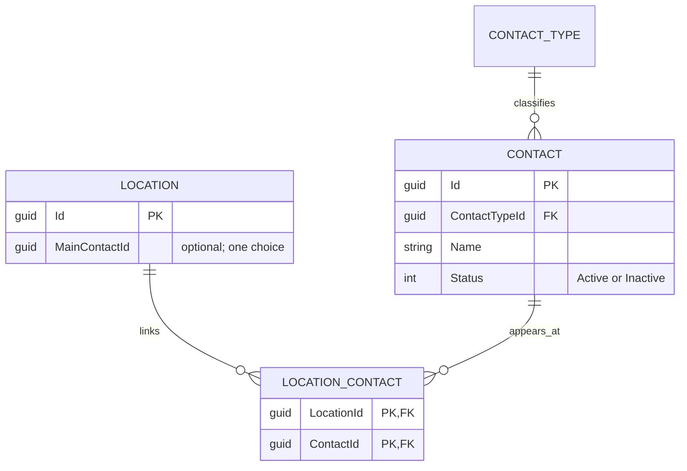

# WI-018 — Contact and Location link model checkpoint

Source T-2.4.1 / DIR-US-003. The user approved the implementation plan, defaults
and 14 Scenario Review intents on 2026-10-02. This is the required model and
written storage-constraint checkpoint, before migration, handlers or screens.
Starting main: `1476def`; branch `feature/wi-018-link-contacts-locations-one-main`.

**Accepted 2026-10-02:** the user answered the review question “yes”, approving
continuation. This document preserves the pre-implementation checkpoint state
below. The activated migration, screens and verification are recorded in
`contact-location-delivery.md`.

## Review question

Can a person be Main at several shops while each shop has one Active Main,
with protection shared by every future screen?

**Proposed answer:** store one MainContactId on each Location, selected from
that shop's links. Main is derived from this one choice; links do not carry
independent Main flags. Replacement changes one choice atomically, and leaves
the outgoing person linked. Domain methods and SQL guards enforce Active
eligibility, first-Main assignment and retention of a Main where Active
Contacts exist. Empty shops can remain without a Main.

## Records and relationships

| Record | Fields | Rules |
| --- | --- | --- |
| Contact | Stable GUID Id, required Name/ContactTypeId, optional Phone/Email, global Active/Inactive Status, SQL Version | Create Active with at least one linked Location; required trimmed name up to 200, nonunique; active Type on a new assignment, unchanged archived Type retained. Phone/email trimmed/optional, 50/254 characters, format only. |
| LocationContact | LocationId + ContactId, navigation to both records | Composite primary key prevents duplicate links. Both foreign keys restrict deletion. One Contact can link to many Locations, including different Customers. |
| Location (extension) | Optional MainContactId; Contacts collection | One Main choice per unique Location row. Existing Customer/Town/Type/Eircode/Version and IDs remain. No editable ownership change. |

The concrete model is in `FieldSales.Api/Directory/Contact.cs`,
`LocationContact.cs` and `Location.cs`. Read/request shapes are in
`FieldSales.Directory.Contracts/ContactContracts.cs`. Contact records remain
separate from staff authentication and future online-ordering accounts.



## Written storage constraint

`ContactModelConfiguration.cs` writes the EF mapping for the two new tables,
status check, restrictive Type/link relationships, roster index and the
composite foreign key:

```sql
FOREIGN KEY Locations(Id, MainContactId)
REFERENCES LocationContacts(LocationId, ContactId)
-- NO ACTION: deleting/changing the selected link is rejected.
```

This requires the selected Contact to belong to the same Location. A single
nullable column on the unique Location row cannot represent two Mains. It also
avoids a two-row demote/promote update, where intermediate uniqueness or
missing-Main states could occur. Neither a scalar nor a filtered unique index
alone would enforce Active eligibility or require a first Main.

The additional database guards are written, for review, in
`contact-location-storage.sql`:

| Guard | Enforcement |
| --- | --- |
| Locations Main guard | Reject an Inactive selection and reject clearing Main while Active links exist. Membership is independently enforced by the composite FK. |
| LocationContacts first-Main guard | After linking, fill an empty Main slot from the first Active person. Serialize on the Location; a multi-row batch selects one deterministically. Inactive-only legacy rosters can remain without a Main until an Active person arrives. |
| Contacts global-status guard | Reject inactivation of a person selected as Main at any shop. Fill an empty inactive-only legacy roster when its first Active person becomes available. |

These guards are set based and cover multiple changed rows. They supplement
the centralized command/model rules; a different screen or a direct SQL write
cannot create two Mains, select an unlinked/Inactive Main, or clear an established
Main while Active links exist. Linked Contacts cannot be deleted because of
restrictive references; there will be no Contact delete endpoint.

Primary-key uniqueness and foreign-key membership follow
[SQL Server's constraint semantics](https://learn.microsoft.com/en-us/sql/relational-databases/tables/primary-and-foreign-key-constraints?view=sql-server-ver16).
The mapping disables the SQL OUTPUT optimization for trigger-backed tables as
required by [EF Core's SQL Server guidance](https://learn.microsoft.com/en-us/ef/core/providers/sql-server/misc).
The guards are design code at this checkpoint; SQL execution, race tests and
the actual migration remain to be verified after review.

## Domain and transaction boundary

- `Contact.Create` validates details and requires initial Locations before
  linking the Active person. A failed multi-shop command rolls back everything.
- `Location.LinkContact` rejects Inactive choices, returns already-linked
  without duplication, and makes the first Active person Main with a notice.
- `Location.SetMain` requires a linked Active person and the expected outgoing
  Main. A different existing Main requires confirmation. It changes only that
  Location, retaining all Contact links and other shops' Main choices.
- `Contact.SetStatus` checks all its linked Locations before inactivation,
  including when the edit starts from a different shop. The database guard
  catches incomplete loading or a concurrent change independently.
- Empty/inactive-only legacy rosters receive their first Active Main when an
  Active person arrives. In normal WI-018 data, a non-Main reactivation leaves
  the existing Main unchanged. WI-020's departed-Main reactivation has separate
  gap semantics and is explicitly deferred.

After review, one ContactStore will own the commands in the existing scoped,
serializable DirectoryDb transaction. It loads canonical rows/rosters, validates
the supplied rowversions and expected Main, and locks affected shops in a stable
order. A stale confirmation requires reload; a confirmed replacement writes one
MainContactId and advances the Location version. No-op Contact edits still check
and advance their version. SQL conflict/deadlock/guard errors become clear
validation or reload responses, with no partial data committed.

Trigger writes advance Location rowversions. Therefore creation/linking must
save the Contact/link rows first without issuing a premature Main pointer
update, then reload affected Locations before any further save or response.
The triggers fill the first pointer in the same transaction; domain decisions
provide the notice. The store must not use the old tracked Location version
after a trigger changes it. This order also avoids the new link/Main foreign-key
cycle. Replacing an existing Main requires no new link, so one versioned
Location update completes it. The approved tests must cover this sequencing.

## Request and screen attachment

Planned API operations behind the staff BFF: Contact create/read/edit and shop
Contact lists; link a Contact; set Main; confirm replacement. The set-Main
request contains candidate, Location version, expected outgoing Main and
explicit confirmation. The server constructs the named question from saved
records, never browser-supplied names. No unlink or delete route is introduced.

H-26 lists Main and linked people with hidden Inactive counts. H-27 shows one
Contact's details/Type/status and all linked shops, indicating where they are
Main. Contact Type reads use the existing archived-labelled projection. The
real contacts usage provider replaces WI-017's empty one, counts distinct
Contacts rather than shop links, and includes Inactive Contacts in the same
Type-retirement transaction.

The user clarified that the same person can be Main at several shops. The
approved Mary example reconciliation retains automatic first-Main assignment:
Mary is Main at Rathdrum and Arklow; Wicklow already has another Main and is
unchanged when Mary is linked or selected elsewhere. The original source's
contradictory “Wicklow still needs one” wording is not implemented as a Main
vacancy after its first Active Contact is linked.

## WI-020 attachment

WI-018 blocks unlinking/retiring a Main and has no No replacement yet flow.
WI-020 will introduce an explicit Replacement Needed gap/outgoing-contact
reference, retain the Inactive person for display, and implement replacement
or inactivation across all shops. It must extend the model and SQL guards
together: allow its explicit flagged exception to the Active-Main requirement,
and ensure reactivation keeps the person an ordinary Contact without restoring
the outgoing Main automatically. Do not weaken guard behavior by dropping it
without replacement constraints and tests. Existing IDs and links remain stable.

## Checkpoint verification and state

The baseline passed all **145** existing Customer/geography/Type/shared-list
scenarios before behavior changes, zero failures/skips. TRX:
`.artifacts/wi018-before/wi018-before_net10.0_20261002145011.trx`.
The complete solution build passed with zero warnings/errors.
After the model changes, both existing predecessor-upgrade checks passed and
confirmed that the current database model still has no pending changes. TRX:
`.artifacts/wi018-checkpoint/wi018-checkpoint_net10.0_20261002150210.trx`.
Console validation against main `1476def` confirms that only WI-018's active
status was added; card/spec content and all earlier statuses remain unchanged.

The model, contracts, mapping and SQL guards are written for review. Contact
mapping is deliberately not activated in DirectoryDbContext, and the new
Location properties are excluded from the current database model. There is no
Contact migration, endpoint, real usage provider or screen yet. The SQL guard
code is not installed or claimed to have passed its later behavioral tests.

WI-018 remains active. Resume only on **`Continue T-2.4.1`** to activate the
mapping, create/install the migration and complete the approved implementation
and verification plan. Main integration remains a separate request.
