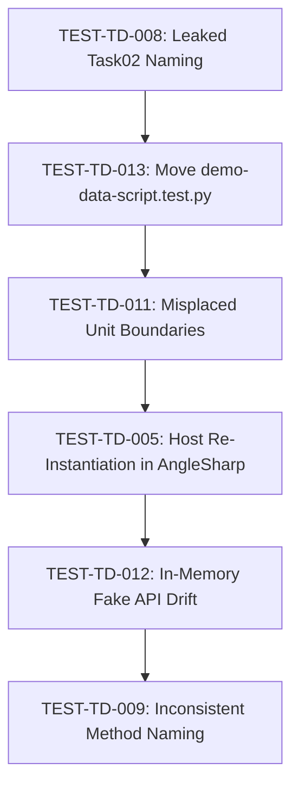

# Test Technical Debt Remediation Backlog & Agent Handoff Guide

This document provides complete context, architectural background, completed milestones, and prioritized backlog items for automated test technical debt remediation in the `Field-Sales` repository.

Any AI agent or developer resuming this work can use this file as the single source of truth to pick the next item, create a branch, plan the remediation, execute the changes, and verify the test suites.

---

## 1. System Overview & Technology Stack

- **Repository**: `FieldSales` (Sales territory, customer, and catalogue management system)
- **Framework**: .NET 10 (`net10.0`, SDK 10.0.101), C# 13, ASP.NET Core Razor Pages & Minimal APIs
- **Database**: Microsoft SQL Server 2022 (`mcr.microsoft.com/mssql/server:2022-latest`) via EF Core 10 & Dapper
- **Testing Tools**:
  - **xUnit v2/v3** with `[Trait("Category", "Unit")]` and `[Trait("Category", "Integration")]`
  - **Testcontainers for .NET 4.3.0** for SQL Server integration testing
  - **Microsoft.AspNetCore.Mvc.Testing** (`WebApplicationFactory`) & **AngleSharp** for Razor Pages HTML characterisation
  - **Node.js Test Runner** (`node --test`) for client-side JavaScript form behavior (`product-unit-form.test.mjs`)
- **Solution File**: [FieldSales.slnx](file:///Users/colmkenna/Source/Field-Sales/FieldSales.slnx)
- **CI Workflow**: [.github/workflows/ci.yml](file:///Users/colmkenna/Source/Field-Sales/.github/workflows/ci.yml)

---

## 2. Test Architecture & Directory Layout

Following the remediation of **TEST-TD-001** and **TEST-TD-002**, tests are strictly separated by test category and domain boundary under `tests/`:

```
tests/
├── Unit/
│   ├── FieldSales.Api/
│   │   ├── FieldSales.Api.UnitTests.csproj          # 15 test files, 168 tests
│   ├── FieldSales.Web/
│   │   ├── FieldSales.Web.UnitTests.csproj          # 11 test files, 133 tests
│   │   └── product-unit-form.test.mjs               # 5 client-side DOM tests
│   └── FieldSales.Identity.Admin/
│       ├── FieldSales.Identity.Admin.UnitTests.csproj # 35 test files in domain subfolders, 258 tests
├── Integration/
│   ├── FieldSales.Api/
│   │   ├── FieldSales.Api.IntegrationTests.csproj   # 12 test files, 100 tests (uses SqlServerFixture)
│   │   └── SqlServerFixture.cs                      # Shared SQL Server container + isolated catalogs
│   ├── FieldSales.Web/
│   │   ├── FieldSales.Web.IntegrationTests.csproj   # 46 test files in domain subfolders, 721 tests
│   │   ├── Assignments/                             # 17 territory and coverage test files
│   │   ├── Catalogue/                               # 11 product, category, and brand test files
│   │   ├── Contacts/                                # 3 contact integration and characterisation test files
│   │   ├── Customers/                               # 3 customer and directory type test files
│   │   ├── Geography/                               # 4 geography and coordinates test files
│   │   └── Infrastructure/                          # WebSqlServerFixture, StaffWebsiteFactory, auth & fixtures
│   ├── FieldSales.Identity.Admin/
│   │   ├── FieldSales.Identity.Admin.IntegrationTests.csproj # 794 tests (uses collection fixture)
│   │   └── (17 subfolders of live EF/SQL Server admin tests)
│   └── FieldSales.DemoData/
│       ├── FieldSales.DemoData.IntegrationTests.csproj       # 3 tests (uses DemoSqlServer)
├── E2E/
│   └── .gitkeep                                     # Reserved for multi-service end-to-end user journeys
└── demo-data-script.test.py                         # Standalone Python script (see TEST-TD-013)
```

### Current Verification Baseline
- **Build**: 0 warnings, 0 errors
- **Unit Tests**: **559 / 559 C# tests passed** (~5s) + **5 / 5 Node tests passed** (<100ms)
- **Integration Tests**: **1,618 / 1,618 tests passed** against SQL Server & SQLite harnesses
- **Grand Total**: **2,177 tests passing (100% pass rate, zero regressions)**

---

## 3. Completed Remediations

| ID | Title | PR | Commit | Summary |
|---|---|---|---|---|
| **TEST-TD-001** | Unshared Docker Container Lifecycle in API and Web Suites | [#14](https://github.com/ColmKenna/Field-Sales/pull/14) | `6ab984e` | Replaced per-test/per-class `MsSqlContainer` instantiations in `FieldSales.Api` and `FieldSales.Web` integration tests with shared, long-lived fixtures (`SqlServerFixture`, `WebSqlServerFixture`) provisioning isolated ephemeral database catalogs (`InitialCatalog = $"Test_{name}_{Guid.NewGuid():N}"`). Cut execution time from ~15 minutes to ~3.5 minutes. |
| **TEST-TD-002** | Monolithic Umbrella `FieldSales.UnitTests` Violating Modularity | [#15](https://github.com/ColmKenna/Field-Sales/pull/15) | `d092c80` | Dissolved monolithic umbrella project into dedicated domain unit test projects under `tests/Unit/` (`FieldSales.Api`, `FieldSales.Web`, `FieldSales.Identity.Admin`), organized integration projects under `tests/Integration/`, and created `tests/E2E/`. |
| **TEST-TD-003** | Process-Wide Environment Variable Mutation in `AdminWebFactory` | [#16](https://github.com/ColmKenna/Field-Sales/pull/16) | `cb09ae2` | Removed static constructor setting process-wide environment variables in `AdminWebFactory`. Replaced with in-memory host settings using `builder.UseSetting(...)` and `builder.ConfigureAppConfiguration(...)`. Added `AdminWebFactoryTests` confirming zero process pollution. |
| **TEST-TD-004** | Redundant Solution-Wide Test Execution and Double-Execution in CI | [#15](https://github.com/ColmKenna/Field-Sales/pull/15) | `d092c80` | Eliminated duplicate execution in CI by partitioning steps into fast-fail unit tests (`--filter "Category=Unit"`) and SQL Server integration tests (`--filter "Category!=Unit"`). |
| **TEST-TD-006** | Complete Absence of Test Traits Preventing Selective Filtering | [#15](https://github.com/ColmKenna/Field-Sales/pull/15) | `d092c80` | Tagged all test classes and methods across all projects with xUnit `[Trait("Category", "Unit")]` and `[Trait("Category", "Integration")]`. |
| **TEST-TD-010** | Unused Dependencies and Vulnerability Warnings in Test Projects | - | `a4c15cd` | Audited packages across test suites and pruned 17 unused package references (including `FluentAssertions`, `NetArchTest.Rules`, `Microsoft.EntityFrameworkCore.InMemory`, `xunit.v3`, and redundant `Moq`/`TimeProvider.Testing`/`Sqlite` references) across `Directory.Packages.props` and test project files. |
| **TEST-TD-007** | Flat Directory Structure and Mingled Helpers in `FieldSales.Web` Integration Tests | - | `ff3ca49` | Reorganized 46 flat integration test files and harnesses in `FieldSales.Web` into 6 domain subfolders (`Assignments/`, `Catalogue/`, `Contacts/`, `Customers/`, `Geography/`, and `Infrastructure/`) preserving git history. |

---

## 4. Prioritized Remaining Backlog

The remaining technical debt findings are ranked below by impact, risk, and recommended execution order:



---

### Finding Details

#### 1. TEST-TD-008: Leaked Sprint/Work-Item Naming in `FieldSales.Identity.Admin` (`Task02*`)
- **Classification**: Organisation debt
- **Severity**: Low | **Effort**: Small
- **Location**:
  - `tests/Integration/FieldSales.Identity.Admin/`
- **Problem**:
  Several test classes, fixtures, and collection definitions are named `Task02*` (e.g. `Task02SqlServerCollection`, `Task02DatabaseFixture`), which is an artifact of temporary sprint/task backlog tickets.
- **Why It Matters**:
  Obscures the purpose of the fixtures for future engineers and creates confusion when searching for the canonical Identity database fixture.
- **Recommended Remediation**:
  Rename `Task02SqlServerCollection` $\rightarrow$ `IdentityAdminSqlServerCollection` (and corresponding fixture classes) and update references across the 17 integration test files.

---

#### 2. TEST-TD-013: Loose Unmanaged Python Script in Test Directory Root
- **Classification**: Organisation debt
- **Severity**: Low | **Effort**: Small
- **Location**:
  - [tests/demo-data-script.test.py](file:///Users/colmkenna/Source/Field-Sales/tests/demo-data-script.test.py)
- **Problem**:
  A standalone Python `unittest` script sits directly in the root of `tests/`. It is not run by `dotnet test` and is omitted from CI workflows.
- **Why It Matters**:
  Clutters the top-level test folder and risks silent bit-rot when `tools/FieldSales.DemoData/` or CLI scripts are modified.
- **Recommended Remediation**:
  Move to `tools/FieldSales.DemoData/scripts/` or `scripts/tests/` and add a step to [.github/workflows/ci.yml](file:///Users/colmkenna/Source/Field-Sales/.github/workflows/ci.yml) (`python3 scripts/tests/demo-data-script.test.py`).

---

#### 4. TEST-TD-011: Misplaced Integration Test Boundaries in Unit Test Projects
- **Classification**: Test architecture debt
- **Severity**: Medium | **Effort**: Small
- **Location**:
  - `tests/Unit/FieldSales.Identity.Admin/Infrastructure/`
- **Problem**:
  Certain tests categorized as Unit tests (e.g., `Pkcs12CertificateLoaderTests`, `StartupHelpersTests`) read physical files from disk or test host bootstrapping.
- **Why It Matters**:
  Unit tests should be in-memory and deterministic without disk or OS certificate dependencies.
- **Recommended Remediation**:
  Either mock the underlying file system/certificate provider or relocate these tests to `tests/Integration/FieldSales.Identity.Admin/Infrastructure/` with `[Trait("Category", "Integration")]`.

---

#### 5. TEST-TD-005: Costly Host Re-Instantiation per Test Method in AngleSharp UI Tests
- **Classification**: Performance debt
- **Severity**: Medium | **Effort**: Medium
- **Location**:
  - `tests/Unit/FieldSales.Identity.Admin/` & `tests/Integration/FieldSales.Identity.Admin/`
- **Problem**:
  AngleSharp-based Razor Page UI tests instantiate `new AdminWebFactory()` per test method merely to render static HTML tags or assert element presence.
- **Why It Matters**:
  Booting the ASP.NET Core DI container and compilation pipeline repeatedly adds multiple seconds of overhead for tests that only inspect HTML markup.
- **Recommended Remediation**:
  Share the factory across test classes using xUnit `IClassFixture<AdminWebFactory>` or render Razor Page views in-memory without spinning up the full HTTP server pipeline.

---

#### 6. TEST-TD-012: In-Memory Fake API Re-Implementation in `StaffWebsiteFactory.TestCatalogueHandler`
- **Classification**: Maintainability debt
- **Severity**: Medium | **Effort**: Medium
- **Location**:
  - `tests/Integration/FieldSales.Web/StaffWebsiteFactory.cs`
- **Problem**:
  A custom fake HTTP handler simulates `FieldSales.Api` responses with internal mutable state dictionaries rather than testing against the actual API contract or canned mocks.
- **Why It Matters**:
  Risk of drift: changes to `FieldSales.Api` will not be reflected in `TestCatalogueHandler`, leading to false confidence where tests pass against the fake but fail in production.
- **Recommended Remediation**:
  Replace the mutable fake with `Api.Server.CreateHandler()` to execute the real API pipeline in-memory, or use explicit, scenario-specific canned responses.

---

#### 7. TEST-TD-009: Inconsistent Test Method Naming Conventions Across Test Suites
- **Classification**: Maintainability debt
- **Severity**: Low | **Effort**: Medium
- **Location**:
  - Across all test projects
- **Problem**:
  Inconsistent method naming: some suites use `Should_Action_When_Condition`, others use `Action_Condition_Expected`, `TestX`, or descriptive sentence names.
- **Recommended Remediation**:
  Standardize on `Should_ExpectedBehavior_When_StateUnderTest` across test suites when touching files for other refactorings.

---

## 5. Execution Workflow for AI Agents & Developers

When picking up an item from this backlog, follow this standardized cycle:

### Step 1: Select Item & Create Descriptive Branch
Pick the next item (e.g., `TEST-TD-003`). Never use a generic name or just an ID for the branch.
```bash
git checkout main
git pull origin main
git checkout -b fix/admin-webfactory-env-var-leak  # Descriptive name!
```

### Step 2: Formulate Plan (`/plan`)
Review the finding details and files. Create an implementation plan artifact in the conversation before modifying code.

### Step 3: Implement & Validate Locally
Execute the code changes. Always verify using the local commands:

```bash
# Set path for dotnet, node, docker
export PATH=$PATH:/usr/local/share/dotnet:/usr/local/bin:/opt/homebrew/bin:~/.docker/bin

# 1. Build solution
dotnet build FieldSales.slnx

# 2. Run fast-fail unit tests (~5s)
dotnet test FieldSales.slnx --filter "Category=Unit" --no-build

# 3. Run client-side node test (<1s)
node --test tests/Unit/FieldSales.Web/product-unit-form.test.mjs

# 4. Run integration tests against SQL Server containers (~3.5m)
dotnet test FieldSales.slnx --filter "Category!=Unit" --no-build -m:1 --settings sqlserver.runsettings --verbosity minimal
```

### Step 4: Commit Changes
Commit with a conventional commit message:
```bash
git add .
git commit -m "fix(test): eliminate process-wide env var mutation in AdminWebFactory (TEST-TD-003)"
```

### Step 5: Push, PR, and Auto-Merge
```bash
# Push branch
git push -u origin <branch-name>

# Create PR
gh pr create --base main --head <branch-name> --title "fix(test): ... (TEST-TD-XXX)" --body "## Summary..."

# Auto-merge when CI passes
gh pr merge <pr-number-or-branch> --squash --auto --delete-branch
```

### Step 6: Update This Backlog Document
Update Section 3 (Completed Remediations) and Section 4 (Prioritized Remaining Backlog) in this file, commit to `main`, and proceed to the next item.
